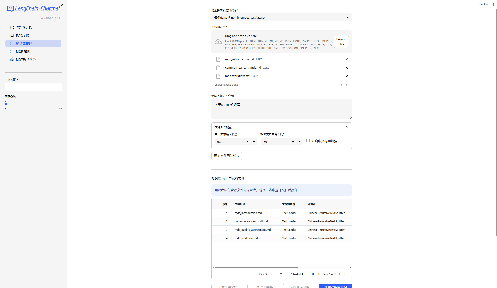
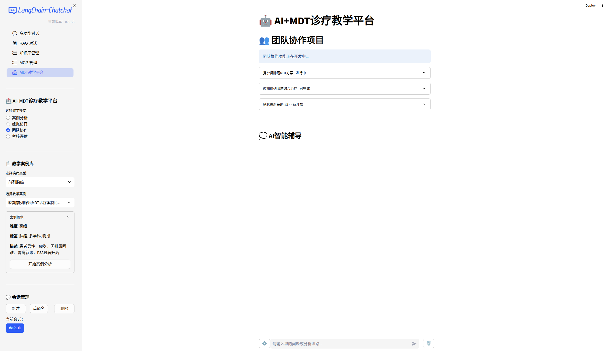
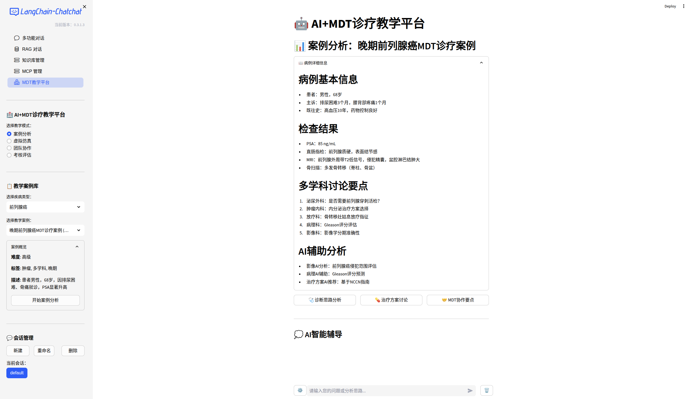
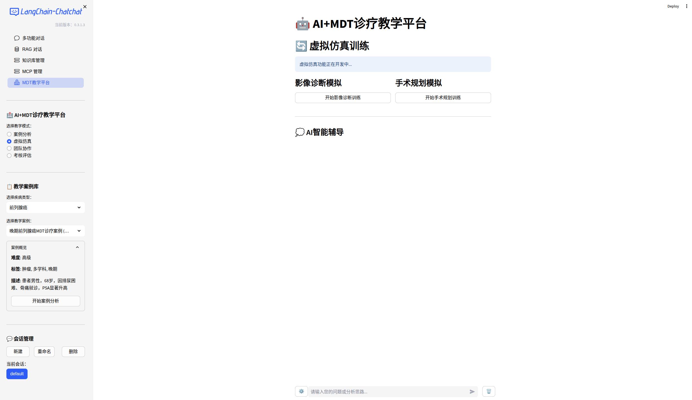
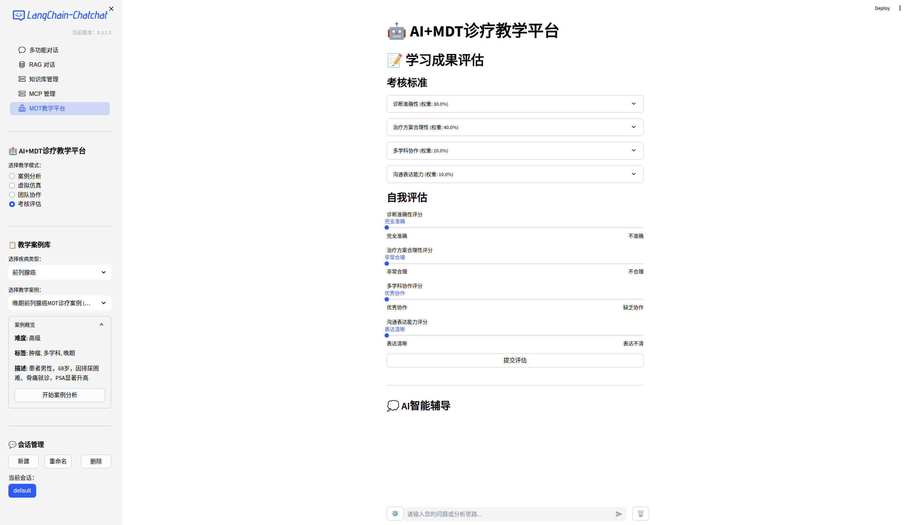

# MDT医学多学科诊疗AI助手

MDT（Multi-Disciplinary Team）医学多学科诊疗AI助手是一个基于大语言模型的智能诊疗辅助系统，专门为医疗多学科协作场景设计。


*图1：MDT知识库构建与检索增强生成架构*

## 项目概述

本项目整合了先进的AI技术，为MDT诊疗提供智能化的知识检索、病例分析和决策支持功能。系统采用模块化设计，支持多种大语言模型，并内置了专业的医学知识库。

## 快速开始

### 环境要求

- Python 3.11+
- uv包管理器
- Ollama（本地模型服务）
- 至少8GB可用内存

### 1. uv环境配置

```bash
# 安装uv包管理器（如果尚未安装）
curl -LsSf https://astral.sh/uv/install.sh | sh

# 进入项目目录
cd /home/kie/code/MDT

# 创建虚拟环境并安装依赖
uv sync
```

### 2. Ollama服务配置

```bash
# 安装Ollama（如果尚未安装）
curl -fsSL https://ollama.ai/install.sh | sh

# 启动Ollama服务
systemctl start ollama

# 拉取默认模型
ollama pull qwen3:4b-instruct-2507-q8_0
ollama pull nomic-embed-text:latest
```

### 3. 快速启动项目

```bash
# 进入chatchat-server目录
cd libs/chatchat-server

# 使用uv运行chatchat初始化
uv run chatchat init

# 初始化知识库
uv run chatchat kb -r

# 启动所有服务（API + WebUI）
uv run chatchat start -a
```

### 4. 端到端启动脚本

创建一键启动脚本 `start_mdt_system.sh`：

```bash
#!/bin/bash

# 启动Ollama服务
echo "启动Ollama服务..."
systemctl start ollama

# 等待Ollama服务就绪
sleep 10

# 启动MDT系统
echo "启动MDT AI系统..."
cd /home/kie/code/MDT/libs/chatchat-server
uv run chatchat start -a
```

## 基于ChatChat的技术基础

本项目基于ChatChat开源框架构建，继承了其强大的RAG（检索增强生成）能力和模块化架构：

### 核心特性
- **知识库管理**：支持多种文档格式，自动向量化存储和语义检索
- **多模型支持**：通过Ollama集成多种大语言模型
- **WebUI界面**：基于Streamlit的交互式用户界面
- **API服务**：提供完整的RESTful API接口

### 当前模型配置

1. **基础语言模型**：
   - `qwen3:4b-instruct-2507-q8_0` - 通义千问3 4B量化版本，提供优秀的中文理解和推理能力
   - 通过Ollama平台本地部署，确保数据隐私和安全

2. **嵌入模型**：
   - `nomic-embed-text:latest` - 高性能文本嵌入模型，用于知识库语义检索

3. **医学知识增强**：
   - 内置MDT医学知识库，包含：
     - MDT基础概念和流程
     - 常见肿瘤MDT诊疗指南
     - 多学科协作规范
     - 质量评估标准

### 模型特点

- **本地部署**：所有模型在本地运行，保护患者隐私
- **中文优化**：Qwen模型对中文有更好的理解和生成能力
- **知识增强**：结合专业医学知识库，提供准确的医学信息
- **多轮对话**：支持复杂的MDT病例讨论场景

## 后续发展计划

### 近期目标
- [ ] 优化MDT知识库内容，增加更多专科疾病诊疗指南
- [ ] 完善病例讨论功能，支持多专家协同分析
- [ ] 开发专科MDT模块（肿瘤、心血管、神经等）

### 中期规划
- [ ] 集成更多中文医学专用模型
- [ ] 支持多模态输入（医学影像、病理图片）
- [ ] 开发移动端应用和API接口

### 长期愿景
- [ ] 构建完整的MDT诊疗辅助生态系统
- [ ] 支持医院信息系统集成
- [ ] 实现个性化诊疗方案推荐

## 系统架构

### 核心组件

1. **API服务器** (端口7861)
   - 提供RESTful API接口
   - 处理知识库检索和模型推理
   - 支持多轮对话管理

2. **WebUI界面** (端口8501)
   - 基于Streamlit的交互式界面
   - 支持MDT病例讨论和知识检索
   - 提供可视化分析工具

3. **知识库系统**
   - 向量化存储医学知识
   - 支持语义检索和相似度匹配
   - 内置MDT专业知识库

4. **模型服务层**
   - 通过Ollama管理本地模型
   - 支持模型热加载和切换
   - 提供统一的模型接口

## 使用场景

### 1. MDT病例讨论
- 多学科专家协同讨论复杂病例
- 基于知识库提供循证医学建议
- 生成个体化治疗方案


*图2：MDT多学科团队协作模式*

### 2. 医学知识检索
- 快速查询MDT诊疗规范
- 检索最新临床指南
- 获取疾病诊疗要点


*图3：MDT病例分析与决策支持*

### 3. 教学培训
- MDT流程模拟训练
- 病例分析练习
- 诊疗决策评估


*图4：MDT虚拟仿真教学系统*

### 4. 质量评估
- MDT诊疗质量监控
- 团队绩效评估
- 持续改进机制


*图5：MDT质量考核与评估体系*

## 开发路线图

### 核心功能
- [ ] 专科MDT模块开发（肿瘤、心血管、神经等）
- [ ] 多模态医学数据支持
- [ ] 实时协作和病例管理
- [ ] 移动端和API接口完善

### 技术优化
- [ ] 知识库检索性能提升
- [ ] 模型管理和监控系统
- [ ] 系统稳定性和响应优化
- [ ] Docker容器化部署支持

### 医学专业化
- [ ] 专科疾病知识库扩展
- [ ] 最新临床指南集成
- [ ] 药物相互作用数据库
- [ ] 医学影像分析支持

## 贡献指南

欢迎医疗专家、开发者和研究人员参与项目开发：
1. 医学知识库贡献
2. 模型优化建议
3. 功能需求反馈
4. 代码开发和测试
5. 文档编写和翻译

## 许可证

本项目采用MIT许可证，详见LICENSE文件。

## 联系我们

如有问题或建议，请通过以下方式联系：
- 项目Issues: [GitHub Issues]
- 邮箱: [项目维护者邮箱]

---

*最后更新: 2025年11月*
